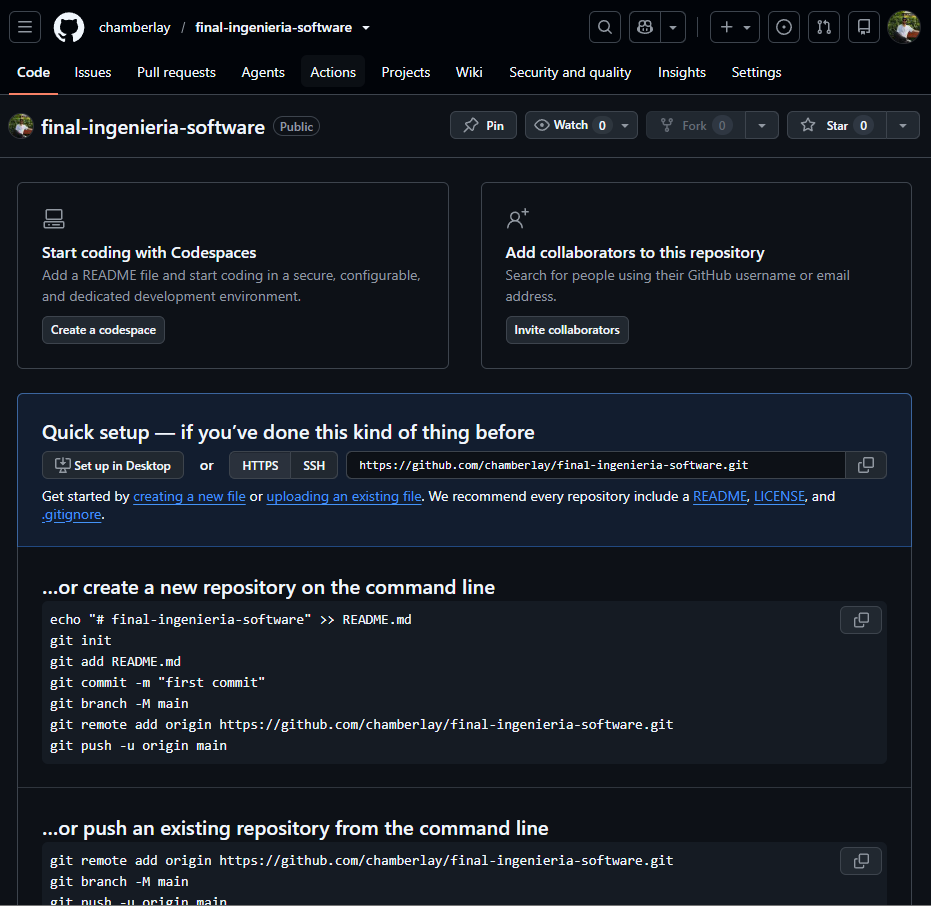
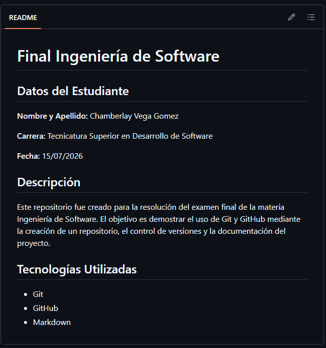
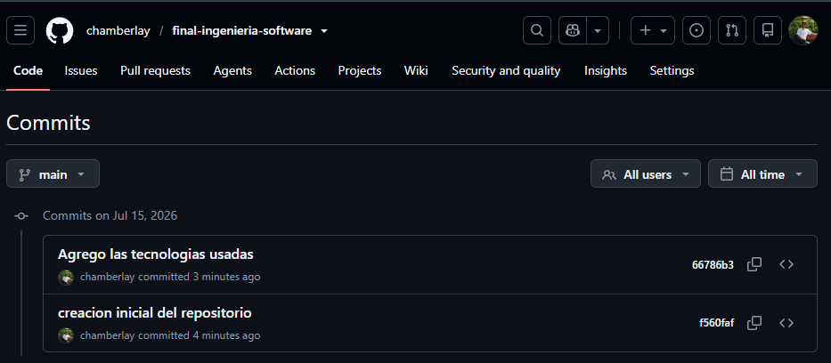
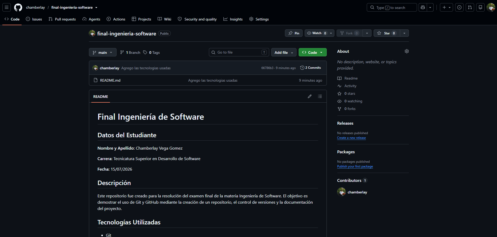
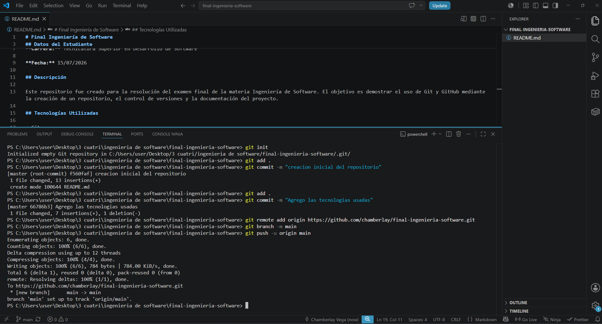

# Final Ingeniería de Software

## Datos del Estudiante

**Nombre y Apellido:** Chamberlay Vega Gomez

**Carrera:** Tecnicatura Superior en Desarrollo de Software

**Fecha:** 15/07/2026

## Descripción

Este repositorio fue creado para la resolución del examen final de la materia Ingeniería de Software. El objetivo es demostrar el uso de Git y GitHub mediante la creación de un repositorio, el control de versiones y la documentación del proyecto.

## Tecnologías Utilizadas

- Git
- GitHub
- Markdown

## ¿Para qué sirven los commits?

Los commits sirven para guardar los cambios realizados en un proyecto, permitiendo mantener un historial de versiones y recuperar estados anteriores si es necesario.

## ¿Qué ventaja tiene GitHub para un equipo de desarrollo?

GitHub permite alojar repositorios en línea y facilita el trabajo colaborativo, permitiendo que varios desarrolladores trabajen sobre un mismo proyecto y compartan los cambios de manera organizada.

## Capturas de Pantalla

### Repositorio creado

### README completo

### Historial de commits

### Repositorio publicado en GitHub

### Creacion y modificacion del README 

